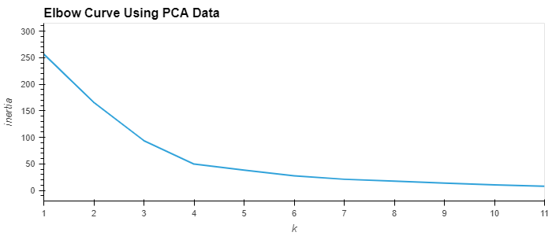
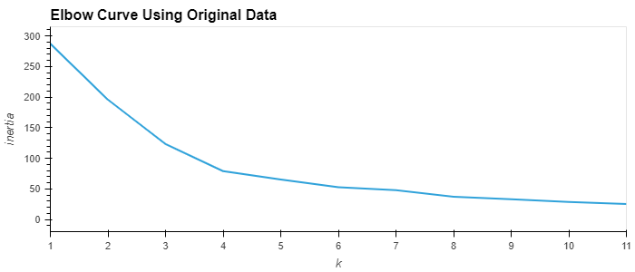
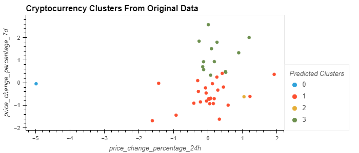
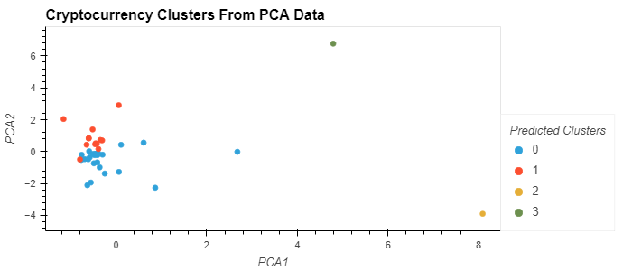

# Unsupervised Learning - Cryptocurrency Clusters
As part of my GWU Data Analysis & Visualization Boot Camp, I created an unsupervised learning model to cluster cryptocurrency based on 24-hour and 7-day price changes.

Technologies used in this project:
* Python
* Jupyter Notebook
* Pandas
* scikit-learn
* hvPlot

I prepared two models for creating clusters, one with the original data and one using Principal Component Analysis (PCA). To find the number of clusters, I used the elbow method.

